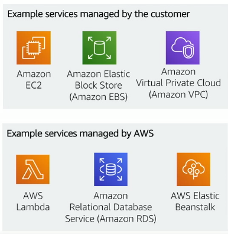

# AWS Shared Responsibility Model

Secara garis besar tanggung jawab dalam infrastructure Cloud Computing ini di bagi menjadi dua bagian :

1. AWS Responsibility : Security of The Cloud
2.

## AWS Responsibility : Security of The Cloud

### AWS Responsibilties :

1. Physical secuity of Data Center

   - Contorlled, need-base access

2. Hardware and Software Infrastructure

   - Storage decommissioning, OS Access loging, and auditing.

3. Network Infrastructure

   - Intrussion Detection

4. Virtualization Infrastructure
   - Instance Isolation

## Customer Responsibility : Security in The Cloud

### Customer Responsibilties :

1. Amazon EC2 instance OS (Patching and maintenance)
2. Aplication (Password, RBAC, etc)
3. Security Group
4. Firewalls
5. Network Configuration
6. Account Management (Logging and Permission)

## Service characteristics and security responsibility

### Infrastructure as a service (IaaS)

- Customer has more flexibility over configuring networking and storage settings
- Customer is responsible for managing more aspects of the security
- Customer configures the access controls
